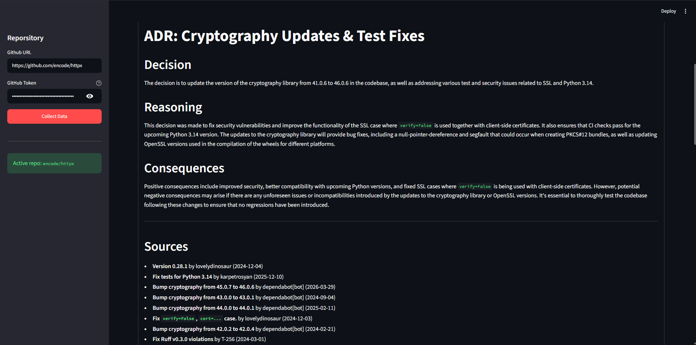
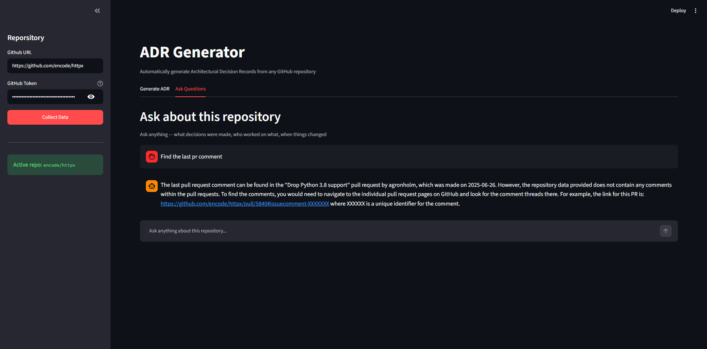

# ADR Generator

A fully local, free multi-agent system that automatically generates **Architectural Decision Records (ADRs)** from any GitHub repository — by analyzing commits, pull requests, and discussions using semantic search and local LLMs.

No API costs. No data sent to external servers. Runs entirely on your machine.

---

## What is an ADR?

An Architectural Decision Record documents a significant technical decision made during a project — what was decided, why it was decided, and what the consequences are. Engineering teams use ADRs to preserve institutional knowledge and help new developers understand why the codebase looks the way it does.

The problem: most teams never write them. This tool generates them automatically from your git history.

---

## Demo





## How it works

The system uses a four-agent pipeline orchestrated by LangGraph:

```
GitHub Repository
       ↓
  Collector Agent     — semantic search retrieves the most relevant PRs and commits for a topic
       ↓
  Clusterer Agent     — KMeans groups related PRs by vector similarity, LLM names each cluster
       ↓
  Reasoner Agent      — reads each cluster, generates a structured ADR (loops per cluster)
       ↓
  Writer Agent        — saves each ADR as a markdown file with sources
       ↓
  adr_output/
  ├── 001-auth-handling.md
  ├── 002-performance-optimization.md
  └── 003-error-handling.md
```

The key insight: instead of asking "summarize this repo", the system asks "what architectural decisions were made about topic X?" — producing focused, auditable decision records rather than vague summaries.

---

## Architecture

### Data layer

| Component | Tool | Purpose |
|---|---|---|
| Raw data storage | SQLite (`github_data.db`) | Commits, PRs, comments, issues |
| Vector storage | ChromaDB (`chroma_store/`) | Semantic search index |
| Embedding model | `nomic-embed-text` via Ollama | Converts text to 768-dimensional vectors |

### Agent layer

| Agent | Model | Job |
|---|---|---|
| Collector | `nomic-embed-text` | Semantic search — finds the 5-25 most relevant PRs and commits for a topic |
| Clusterer | KMeans + `mistral:7b` | Groups PRs by vector similarity, asks LLM to name each cluster |
| Reasoner | `mistral:7b` | Reads each cluster, generates ADR with Decision / Reasoning / Consequences sections |
| Writer | — | Saves ADRs as markdown files with source PR references |

### Orchestration

LangGraph manages the agent graph with a conditional loop on the Reasoner — it processes one cluster per invocation and loops until all clusters are complete, with full state checkpointing.

```
collector → clusterer → reasoner ↻ (loops per cluster) → writer → END
```




### State

```python
class ADRState(TypedDict):
    repo: str                      # owner/repo identifier
    topic: str                     # user's query topic
    n_results: int                 # how many PRs to retrieve
    relevant_prs: List[dict]       # collector output
    relevant_commits: List[dict]   # collector output
    clusters: List[dict]           # clusterer output
    draft_adrs: List[str]          # reasoner output (accumulates)
    final_adrs: List[str]          # writer output (file paths)
    current_cluster_index: int     # loop tracker
    errors: List[str]              # error log
```

### File structure

```
ADR-Generator/
├── ui.py                  # Streamlit web interface
├── graph.py               # LangGraph graph definition and compilation
├── state.py               # Shared ADRState TypedDict
├── config.py              # MAX_PAGES and other settings
├── database.py            # SQLite schema and save functions
├── embedder.py            # ChromaDB embedding pipeline
├── github_collector.py    # GitHub API data collection with parallel comment fetch
├── search.py              # Standalone semantic search for testing
├── agents/
│   ├── collector.py       # Semantic search agent
│   ├── clusterer.py       # KMeans + LLM clustering agent
│   ├── reasoner.py        # ADR generation agent
│   └── writer.py          # Markdown file writer agent
├── adr_output/            # Generated ADR files (created at runtime)
├── chroma_store/          # ChromaDB vector index (created at runtime)
├── github_data.db         # SQLite database (created at runtime)
├── .env                   # GitHub token (not committed)
└── requirements.txt
```

---

## Design decisions

**Why fully local?**
Sending proprietary codebases to external APIs is a compliance risk for many engineering teams. Running locally with Ollama means the system works in air-gapped environments where data privacy is a requirement — not just a preference.

**Why KMeans + LLM for clustering, not LLM alone?**
Pure LLM clustering is slow and can hallucinate groupings. KMeans on embedding vectors is deterministic and fast. The LLM is only used for the cheaper task of naming each cluster — not for deciding which PRs belong together. This separates mathematical precision from semantic labeling.

**Why not dump all PRs into one prompt?**
A repo with thousands of PRs exceeds any model's context window. Semantic search narrows to the 5-25 most relevant items before any LLM call — keeping inference fast and focused on what actually matters for the topic.

**Why `issues/{number}/comments` instead of `pulls/{number}/comments`?**
GitHub treats PRs as a type of issue internally. Discussion comments — where developers debate architectural choices — live under the issues endpoint. The pulls endpoint returns code-line review comments ("rename this variable") which add noise without signal.

**Why parallel comment fetching?**
Sequential comment fetching requires one HTTP request per PR — 300 PRs means 300 sequential waits. `ThreadPoolExecutor` with 10 workers fetches 10 PRs simultaneously, reducing collection time by ~10x.

---

## Requirements

- Python 3.11+
- [Ollama](https://ollama.ai) installed and running
- NVIDIA GPU with 4GB+ VRAM recommended (CPU works, slower)
- GitHub personal access token (free, read-only)

**Models needed:**
```bash
ollama pull nomic-embed-text   # embedding model (270MB)
ollama pull mistral            # reasoning model (4GB)
```

---

## Installation

```bash
# clone the repo
git clone https://github.com/Ajzal-me/ADR-Generator.git
cd ADR-Generator

# create virtual environment
python -m venv .venv
.venv\Scripts\activate        # Windows
source .venv/bin/activate     # Mac/Linux

# install dependencies
pip install -r requirements.txt

# create .env file
echo TOKEN=your_github_token_here > .env
```

---

## Running

Make sure Ollama is running first:
```bash
ollama serve
```

Then start the UI:
```bash
streamlit run ui.py
```

Open `http://localhost:8501` in your browser.

---

## Usage

**Step 1 — Collect**
Enter any public GitHub repository URL and your GitHub token in the sidebar. Click "Collect Data". The system fetches commits, PRs, comments and issues (limited to `MAX_PAGES` pages per endpoint, configurable in `config.py`).

**Step 2 — Generate ADRs**
Enter a topic in the main area — for example "authentication", "performance", "error handling", "caching". Adjust the PR retrieval count with the slider (5-25). Click "Generate ADRs".

The four agents run in sequence. Expect 2-5 minutes depending on hardware and number of clusters.

**Step 3 — Read and download**
Generated ADRs appear in the browser with a download button for each. Each ADR includes:
- Decision — what was decided
- Reasoning — why, based on actual PR discussions
- Consequences — positive and negative outcomes
- Sources — the exact PRs that informed the decision

**Step 4 — Ask questions**
Use the "Ask Questions" tab to query the repository conversationally. The system retrieves relevant PRs and commits via semantic search and answers with the local LLM.

---

## Configuration

```python
# config.py
MAX_PAGES = 3    # pages per GitHub API endpoint (100 items/page)
                 # MAX_PAGES=3 → up to 300 commits, 300 PRs
                 # increase for larger repos, decrease for faster collection
```

---

## Known limitations

- Date-based queries ("what changed in June 2024") use semantic search, not date filtering. ChromaDB supports metadata filtering via `where` clause — not yet wired into the chat interface.
- Local models (mistral:7b) produce good but not GPT-4 quality prose. The architecture and decision extraction is sound; the writing style reflects the model's capability.
- Very large repos (10,000+ commits) will take significant time to embed. Use `MAX_PAGES` to limit collection scope.
- ChromaDB file locking on Windows can cause issues if Streamlit is restarted mid-session. If this occurs, close the browser tab, stop Streamlit, and restart.

---

## Stack

| Layer | Technology |
|---|---|
| Agent orchestration | LangGraph |
| Local LLM inference | Ollama |
| Reasoning model | Mistral 7B (Q4 quantized) |
| Embedding model | nomic-embed-text |
| Vector database | ChromaDB |
| Relational database | SQLite |
| Clustering | scikit-learn KMeans |
| Data collection | GitHub REST API + PyGithub |
| Web interface | Streamlit |
| Parallel I/O | Python ThreadPoolExecutor |

---


## Roadmap

**Date-aware querying**
The chat interface uses semantic search which finds meaning, not time. ChromaDB supports metadata filtering via its `where` clause — wiring this up would let users ask "what changed in Q3 2024" and get accurate results.

**Parallel embedding**
Embedding 300+ items runs sequentially — one Ollama call at a time. Using `ThreadPoolExecutor` on the embedding loop (same pattern used for PR comment fetching) would cut embedding time by 5-10x.

**Confidence scoring on ADRs**
ADRs currently have no signal about how strongly evidenced they are. A cluster backed by 8 detailed PRs with rich discussions should score higher confidence than one backed by 2 vague commits. Adding a confidence score per ADR would make the output more trustworthy.

**Private repository support**
Currently works on any public repo. Private repos require passing the token through to GitPython for local clone access — the architecture already supports this, it just needs wiring.

**Docker Compose deployment**
The system runs locally but has no one-command setup for other machines. A Docker Compose file wrapping Ollama, ChromaDB, and the Streamlit app would make it deployable anywhere.

**Incremental updates**
Re-collecting a repo fetches everything from scratch. Storing the last collection timestamp and only fetching new commits/PRs since then would make re-runs significantly faster for active repositories.

## Author

Built by [Ajzal](https://github.com/Ajzal-me) — a local-first multi-agent system for engineering teams that want to preserve architectural knowledge without sending their codebase to external APIs.
